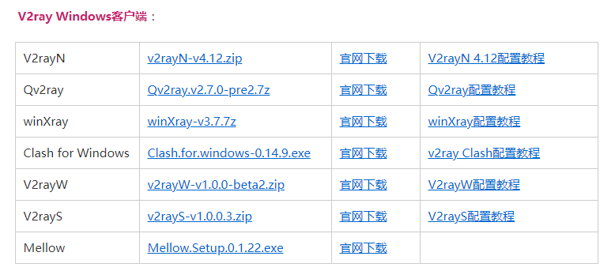
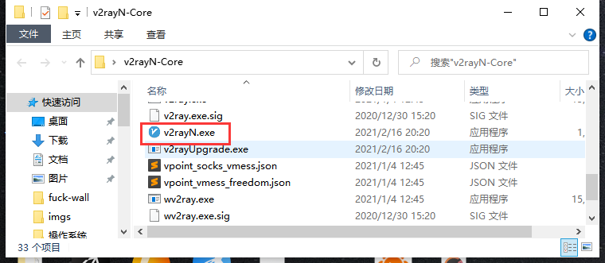
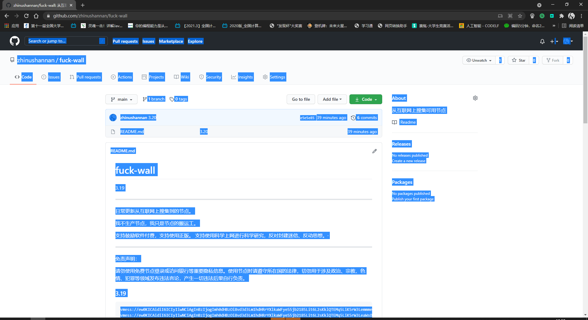
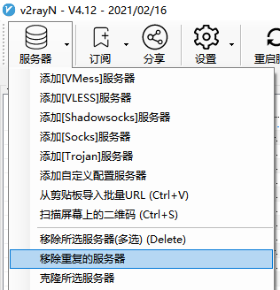
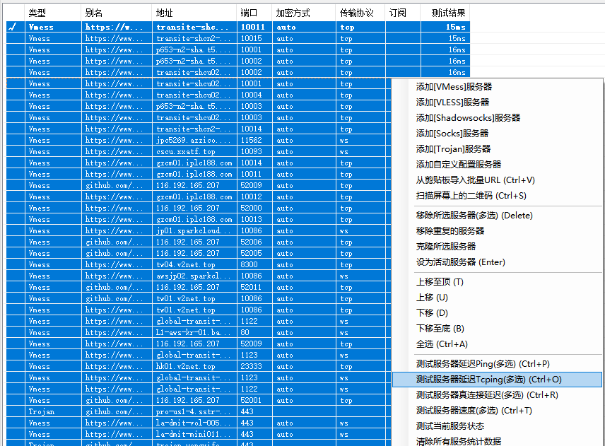

# 如何使用所提供的链接

### 下载所需要的相关软件

v2ray下载地址：[https://tlanyan.me/v2ray-clients-download/](https://tlanyan.me/v2ray-clients-download/)

我用的是[v2rayN](https://tlanyan.me/download.php?filename=/v2/windows/v2rayN-v4.12.zip)（安卓和iOS的那个地址里也有），下载完成后直接解压，双击如图文件：

打开这个网址：[fuck-wall](https://github.com/zhinushannan/fuck-wall)，直接CTRL+A全选，然后CTRL+C复制

然后去导入节点

然后单击它一下，打开界面，点击服务器，再点击移除重复服务器

然后在此界面CTRL+A选中所有节点进行测速

测试结果数值越小它的速度就越快

